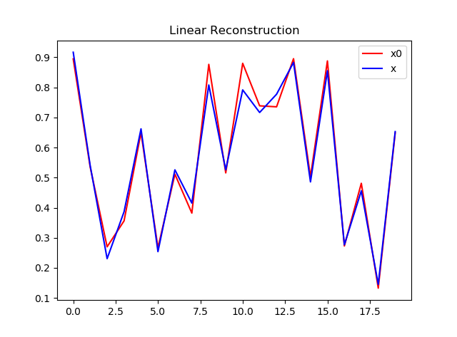

# Gandalf
> Inverse Engineering via AI

## Features
+ Home-made/Integrated machine learning/artificial intelligence algortihm based on Tensorflow, Keras, Scikit-learn

## Status
Working on it, this project is being converted